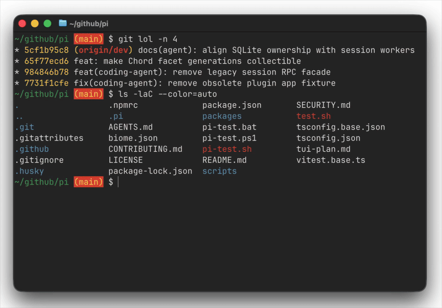

# ghostty-themes-bar

A thin, 3-line bottom-bar theme picker for [Ghostty](https://ghostty.org) (macOS, Linux).

Unlike fullscreen pickers, `ghostty-themes-bar` keeps almost all of your screen
intact. Ghostty reloads its color palette as you browse, so you see your
*actual* prompt, shell output, `git log`, vim buffer, etc. recolor live —
not a fake preview panel.

## Requirements

- [Ghostty](https://ghostty.org) 1.0+ (config reload tested on 1.3.1)
- [`ghostty-themes`](https://github.com/flyerAI2025/ghostty-themes) — used for config writes + reload
- [`fzf`](https://github.com/junegunn/fzf) — `brew install fzf` (macOS), or your Linux distro's package manager
- `zsh` — ships by default on macOS; install via your Linux distro's package manager if it isn't already present

## Install

```bash
git clone https://github.com/Texarkanine/ghostty-themes-bar.git
cp ghostty-themes-bar/ghostty-themes-bar ~/.local/bin/
chmod +x ~/.local/bin/ghostty-themes-bar
```

Make sure `~/.local/bin` is on your `PATH`, and that `ghostty-themes` and `fzf`
are installed and on `PATH` too.

## Usage

Run **inside a Ghostty window** with whatever you want to evaluate already on
screen (prompt, vim, `git log`, etc.):

```bash
ghostty-themes-bar
```

A 3-line fzf bar docks to the bottom of your terminal. Everything above stays
put; Ghostty reloads colors on each highlight so you see how your actual
content looks in that theme.

| Key | Action |
|-----|--------|
| `↑` `↓` | Browse — theme applies to Ghostty in real time |
| Type | Fuzzy filter by theme name |
| `Enter` | Keep the current theme |
| `Esc` / `Ctrl-C` | Cancel and restore your original theme |

### Options

```bash
GHOSTTY_THEMES_BAR_HEIGHT=4 ghostty-themes-bar    # taller bar (default 3)
GHOSTTY_THEMES_BAR_COLOR=dark ghostty-themes-bar  # dark themes only (dark | light | all)
```

| Env var | Default | Meaning |
|---------|---------|---------|
| `GHOSTTY_THEMES_CMD` | `ghostty-themes` | command used for config write + reload |
| `GHOSTTY_THEMES_BAR_HEIGHT` | `3` | height of the fzf bar, in lines |
| `GHOSTTY_THEMES_BAR_COLOR` | `all` | theme filter passed to `ghostty +list-themes --color=` |
| `GHOSTTY_CONFIG` | see below | Ghostty config file to read the current theme from |

`GHOSTTY_CONFIG` defaults to `$XDG_CONFIG_HOME/ghostty/config` if `XDG_CONFIG_HOME`
is set, else `~/Library/Application Support/com.mitchellh.ghostty/config` on
macOS or `~/.config/ghostty/config` on Linux — mirroring Ghostty's own config
resolution.

## How it works

On each fzf focus change, the picker:

1. Reads themes from `ghostty +list-themes --plain`
2. Hands the highlighted name to `ghostty-themes --apply-preview <name>`, which
   writes `theme = <name>` to the Ghostty config and triggers a reload
3. On cancel (`Esc`/`Ctrl-C`), restores whatever `theme = ...` was set before
   you started
4. On accept (`Enter`), calls `ghostty-themes --apply <name>` to persist it

## Related

- [ghostty-themes](https://github.com/flyerAI2025/ghostty-themes) — fullscreen fzf picker this wraps for reload logic
- [ghostty-theme-switch](https://github.com/whyy9527/ghostty-theme-switch) (`gts`) — similar live-reload idea, no fake preview panel, but still fullscreen
- [Ghostty discussion #4261](https://github.com/ghostty-org/ghostty/discussions/4261) — feature request for a native theme selector

## License

GPL-3.0 — see [LICENSE](LICENSE).
